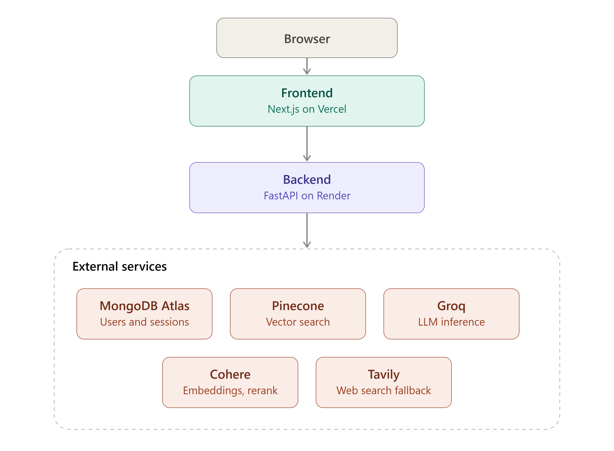
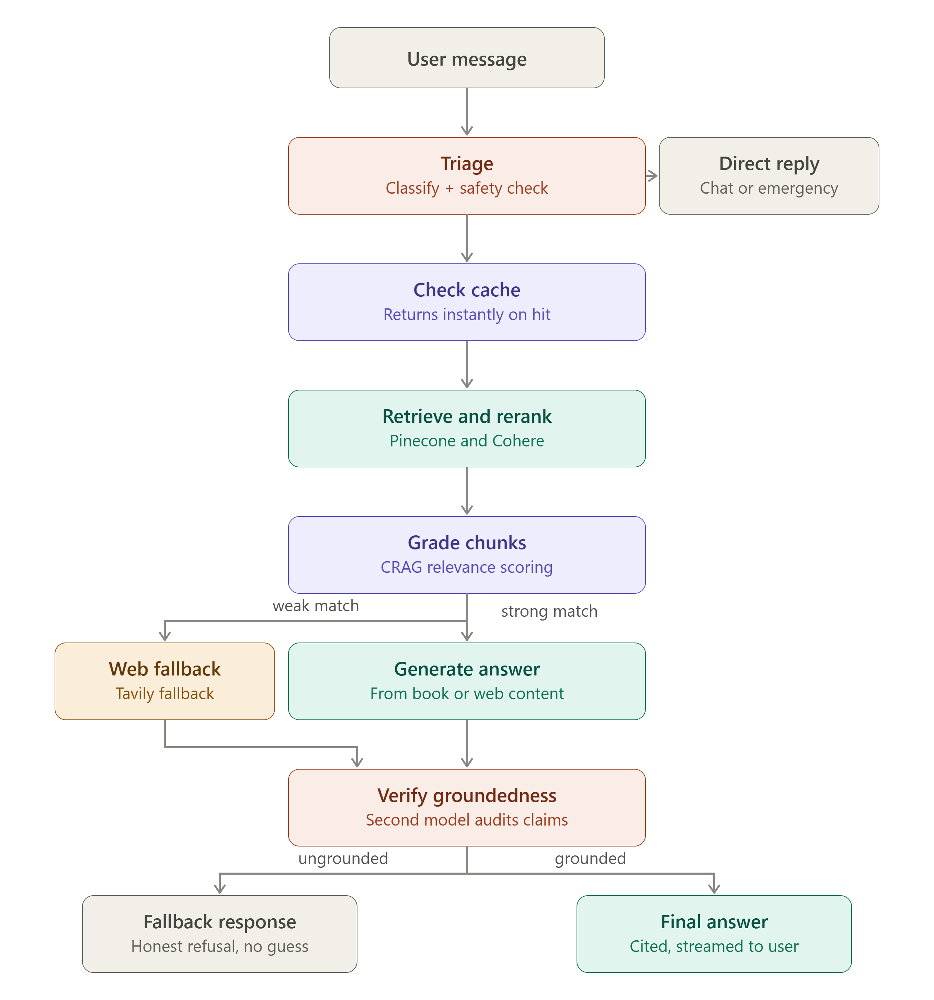

<h1 align="center">MedBot</h1>

<p align="center">
  A retrieval-augmented medical assistant with cited, verified answers, guest and registered chat modes, persistent sessions, and an admin dashboard.
</p>

<p align="center">
  
  
  
  
  
  
</p>

---

## Overview

MedBot answers medical questions grounded in a curated reference text — *A System of Diagnosis in Outline* — using a retrieval-augmented generation pipeline built on LangGraph. Every answer is retrieved, graded, generated, and independently verified for groundedness before it reaches the user; when the reference material is insufficient, the system falls back to live web search rather than guessing, and refuses outright when it still can't ground a claim.

The product wraps that pipeline in a full application: streamed chat over Server-Sent Events, guest access with a question cap, registered accounts with persistent multi-session history, and an admin dashboard for usage visibility.

## Architecture

**Deployment topology.** The frontend is a Next.js app that talks to a FastAPI backend over a JSON/SSE API. The backend is the only service that touches external providers — vector search, embeddings, LLM inference, reranking, web search, and the user/session store all sit behind it.

| Layer | Responsibility |
|---|---|
| **Frontend** — Next.js on Vercel | Chat UI, auth screens, session sidebar, admin dashboard |
| **Backend** — FastAPI on Render | Auth, session management, the LangGraph RAG pipeline, streaming responses |
| **MongoDB Atlas** | Users, guest usage, chat sessions and messages |
| **Pinecone** | Vector index over the ingested reference text |
| **Cohere** | Embeddings for ingestion/retrieval and reranking of retrieved chunks |
| **Groq / OpenRouter** | LLM inference for grading, generation, and verification |
| **Tavily** | Web search fallback when the reference text lacks coverage |

## The RAG pipeline



Every incoming message is routed through a compiled LangGraph state machine (`backend/app/graph`):

1. **Triage** — classifies the message (general chat, emergency, follow-up reformat, or a medical question) and screens for emergencies before anything else runs.
2. **Check cache** — a semantic cache short-circuits repeat or near-duplicate questions with an instant answer.
3. **Retrieve and rerank** — pulls candidate chunks from Pinecone and reranks them with Cohere.
4. **Grade chunks** — a CRAG-style relevance grader scores the retrieved evidence as correct, weak, or incorrect.
5. **Generate** — on a strong match, the answer is generated from the graded book chunks; on a weak match, the query is rewritten and escalated to live web search via Tavily before generating from web content.
6. **Verify groundedness** — a second model independently audits the generated answer's claims against the source evidence.
7. **Final answer or honest fallback** — grounded answers are formatted and streamed to the user; ungrounded or unsupported answers are replaced with an explicit fallback rather than a fabricated response.

The full node sequence, timings, and routing decisions for each request are logged server-side for debugging and evaluation.

## Features

- **Streamed chat** over Server-Sent Events, with live stage labels ("Searching reference material", "Verifying accuracy", …) as the pipeline progresses.
- **Guest mode** — no signup required, capped at a configurable number of questions per guest.
- **Registered accounts** — email/password signup and login with JWT sessions; Google OAuth wiring is in place via Authlib.
- **Persistent chat sessions** — registered users get multiple named, resumable conversations with a per-session message cap, backed by MongoDB.
- **Admin dashboard** — a password-gated view of registered users and guest activity/usage.
- **Groundedness verification** — answers are checked against retrieved evidence before being returned; the system will refuse rather than hallucinate.
- **Web search fallback** — automatically escalates to Tavily when the reference corpus doesn't cover the question.
- **Resumable ingestion pipeline** — structure-aware PDF chunking with contextual (chapter/section-prefixed) embeddings, checkpointed so a rate-limit failure never forces a full restart.

## Tech stack

**Backend** — FastAPI, LangGraph, LangChain, Pinecone, Cohere (embeddings + rerank), Groq / OpenRouter (LLM inference), Tavily (web search), MongoDB (via Motor), Authlib + python-jose (auth), PyMuPDF / pypdf (ingestion), served with Uvicorn.

**Frontend** — Next.js 16 (App Router), React 19, Tailwind CSS 4, react-markdown.

## Project structure

```
Medbot/
├── architecture/            System and pipeline diagrams
├── backend/
│   ├── app/
│   │   ├── graph/           LangGraph nodes, routing, and state graph
│   │   ├── models/          Pydantic request/response and domain schemas
│   │   ├── routers/         auth, admin, sessions endpoints
│   │   ├── services/        auth, database, caching, retrieval, reranking,
│   │   │                    embeddings, web search, session memory
│   │   ├── utils/           logging, retry helpers
│   │   ├── config.py        Environment-driven settings
│   │   ├── dependencies.py  Identity resolution (guest / user / admin)
│   │   └── main.py          FastAPI app, /chat streaming endpoint
│   ├── ingest.py            PDF -> chunks -> embeddings -> Pinecone
│   └── data/                Source PDF and ingestion checkpoint (gitignored)
└── frontend/
    ├── app/                 Routes: chat, login, admin login/dashboard
    ├── components/          Chat window, session sidebar, auth panel, etc.
    └── lib/                 API client, auth, and session helpers
```

## Getting started

### Prerequisites

- Python 3.14+ and [uv](https://docs.astral.sh/uv/)
- Node.js 20+
- A MongoDB Atlas cluster (or local MongoDB instance)
- API keys for Groq, OpenRouter, Cohere, Pinecone, and Tavily

### Backend

```bash
cd backend
uv sync
```

Create `backend/.env` with the variables listed below, then run:

```bash
uv run uvicorn app.main:app --reload
```

The API is served at `http://localhost:8000`.

### Frontend

```bash
cd frontend
npm install
```

Create `frontend/.env.local`:

```
NEXT_PUBLIC_API_BASE_URL=http://localhost:8000
```

```bash
npm run dev
```

The app is served at `http://localhost:3000`.

### Ingesting the reference corpus

```bash
cd backend
uv run python ingest.py --pdf data/source.pdf --dry-run
uv run python ingest.py --pdf data/source.pdf
```

Ingestion checkpoints its progress, so it can be safely re-run after a rate-limit interruption with the same command; pass `--reset` to start over.

## Environment variables

### Backend (`backend/.env`)

| Variable | Purpose |
|---|---|
| `GROQ_API_KEY` | LLM inference (generation) |
| `OPENROUTER_API_KEY` | LLM inference (grading / verification) |
| `COHERE_API_KEY` | Embeddings and reranking |
| `PINECONE_API_KEY` | Vector index access |
| `TAVILY_API_KEY` | Web search fallback |
| `MONGODB_URI` / `MONGODB_DB_NAME` | Users, sessions, guest usage |
| `JWT_SECRET_KEY` / `JWT_ALGORITHM` / `JWT_EXPIRE_MINUTES` | Auth token signing |
| `GOOGLE_CLIENT_ID` / `GOOGLE_CLIENT_SECRET` / `GOOGLE_REDIRECT_URI` | Google OAuth (optional) |
| `ADMIN_PASSWORD` | Admin dashboard login |
| `GUEST_QUESTION_LIMIT` | Guest question cap |
| `SESSION_MESSAGE_LIMIT` | Per-session message cap for registered users |
| `FRONTEND_URL` | CORS / OAuth redirect target |
| `GRADING_MODEL` / `GENERATION_MODEL` / `VERIFIER_MODEL` | Model routing per pipeline stage |
| `PINECONE_INDEX_NAME` / `PINECONE_CLOUD` / `PINECONE_REGION` | Vector index configuration |
| `APP_ENV` / `LOG_LEVEL` | Runtime environment and logging |

See `app/config.py` for defaults and the full list of tunables (retrieval depth, CRAG grading thresholds, chunking parameters).

### Frontend (`frontend/.env.local`)

| Variable | Purpose |
|---|---|
| `NEXT_PUBLIC_API_BASE_URL` | Base URL of the backend API |

## API surface

| Endpoint | Description |
|---|---|
| `POST /chat` | Streams a chat response over SSE (guest or registered) |
| `POST /auth/signup` · `/auth/login` | Email/password authentication |
| `POST /auth/guest` | Issues a guest session token |
| `POST /auth/admin-login` | Admin authentication |
| `GET/POST /sessions`, `GET /sessions/{id}/messages`, `DELETE /sessions/{id}` | Session management (registered users) |
| `GET /admin/stats` | User and guest activity (admin only) |
| `GET /health` | Health check |
